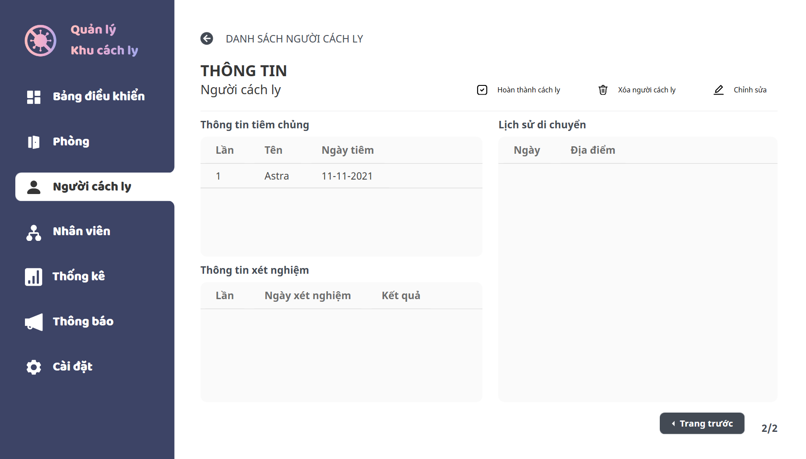

<h1>Quarantine Area Management</h3>

[](https://github.com/ltk84/QuanLyKhuCachLy)
[](https://github.com/ltk84/QuanLyKhuCachLy)
[](https://github.com/ltk84/QuanLyKhuCachLy)
[](https://github.com/ltk84/QuanLyKhuCachLy)
[](https://github.com/ltk84/QuanLyKhuCachLy)
[](https://github.com/ltk84/QuanLyKhuCachLy)
[](https://github.com/ltk84/QuanLyKhuCachLy)

[](https://www.uit.edu.vn/)
[](https://www.uit.edu.vn/)
[](#team)

<br>

<p align="center">
 </a>
</p>

<p align="center">
<i>The title means "<b>Quarantine Area Management</b>".</i>
<br/>
<i>This is a school project.</i>
</p>

<h3 align="center">Currently, the world are facing the Covid-19 pandemic and the need for quarantine areas has become very necessary. 🚩</h3>
<h3 align="center">Therefore, the management of the quarantine area needs to be done effectively and quickly in the context of an increasing number of people who need to be quarantined. 📈</h3>
<h3 align="center">The use of computer software to manage the quarantine area will help the work be done faster and more precisely. 📊</h3>

---

## 📝 Table of Contents

- [Introduction](#introduction)
- [Getting Started](#getting-started)
	- [Prerequisites](#prerequisites)
	- [Installation](#installation)
- [Usage](#usage)
- [Features](#features)
	- [Authentication](#authentication)
	- [Room Management](#room-management)
 	- [Person Management](#person-management)
 	- [Staff Management](#staff-management)
	- [Statistics](#statistics)
	- [Notification](#notification)
	- [Recommendation](#recommendation)
	- [Quarantine Area Setting](#quarantine-area-setting)
- [Tech Stack](#tech-stack)
- [References](#references)
	- [Libraries](#libraries)
	- [Resources](#resources)
- [Team](#team)
- [Contributing](#contributing)
- [Future Development](#future-development)
- [License](#license)

## Introduction

## Getting Started

### Prerequisites

This project uses [SQL Sever Express](https://www.microsoft.com/en-us/sql-server) as **Database Management System** and [.NET Framework](https://dotnet.microsoft.com/) (4.7.2 or higher).

* **SQL Sever Express** can be downloaded [here](https://go.microsoft.com/fwlink/?linkid=866658).
* **.NET Framework** can be downloaded [here](https://dotnet.microsoft.com/download/dotnet-framework).

Please make sure that your computer has these installed before continuing to the installation.

### Installation

1. Download [QLKCLInstallation.zip]() file.
2. Extract the zip file.
3. Run **createdb.bat** file in **InitDB** folder.
4. Run **QLKCLSetup.msi** file in root folder to install.

## Usage
### Minimum system requirements:
* **OS:** Windows 10.
* **RAM:** 4GB.
* **Processor:** 1 GHz or faster processor or SoC.
* **Hard disk space:** 50 MB.

## Features

<br/>

<p align="center">
 </a>
<i>Quarantine Area Management Features</i>
</p>

<br/>

### Authentication
* Users will be provided with an authenticated account to access the system. 
* Users can change the account’s password once the system is logged in.

<br/>

<p align="center">
 </a>
<i>Authentication UI</i>
</p>

<br/>

<p align="center">
 </a>
<i>Change Password UI</i>
</p>

<br/>

### Room Management
* Users can manage rooms with add (excel, manually)/edit/delete/clear/mark as completed room(s); search for/filter rooms; export room list.
* Users can also manage room’s quarantine persons.

<br/>

<p align="center">
 </a>
<i>Room Management UI</i>
</p>

<br/>

<p align="center">
 </a>
<i>Room Detail UI</i>
</p>

<br/>

<p align="center">
 </a>
<i>Add Room Manually UI</i>

<br/>

</p>
<p align="center">
 </a>
<i>Edit Room UI</i>
</p>

<br/>

</p>
<p align="center">
 </a>
<i>Changing Room Severity Confirmation UI</i>
</p>

<br/>

</p>
<p align="center">
 </a>
<i>Update Person In Room UI</i>
</p>

<br/>

### Person Management
* Users can manage persons with add (excel, from google sheets, muanually)/edit/delete/mark as completed peron(s); search for/filter persons; export peron list. 
* Users can also change room for specific peron and update testing result based on excel.

<br/>

<p align="center">
 </a>
<i>Person Management UI</i>
</p>

<br/>

<p align="center">
 </a>
<i>Person Detail UI</i>
</p>

<br/>

<p align="center">
 </a>
<i>Person Detail 2 UI</i>
</p>

<br/>

<p align="center">
 </a>
<i>Add Person Manually UI</i>

<br/>

<p align="center">
 </a>
<i>Add Person Manually 2 UI</i>

<br/>

<p align="center">
 </a>
<i>Add Person Manually 3 UI</i>

<br/>

<p align="center">
 </a>
<i>Add Person Manually 4 UI</i>

<br/>

### Staff Management
* Users can manage staffs with add (excel, manually)/edit/delete staffs; search for/filter staffs; export staff list.

<br/>

<p align="center">
 </a>
<i>Staff Management UI</i>
</p>

<br/>

<p align="center">
 </a>
<i>Staff Detail UI</i>
</p>

<br/>

<p align="center">
 </a>
<i>Execute Successfully UI</i>

<br/>

### Statistics
* Users can view and export statistical information by time, object.

<br/>

<p align="center">
 </a>
<i>Statistics UI</i>

<br/>

### Notification
* Users can send notification messages to quarantine person’s phone numbers. 
* Users can manage (add/edit/delete) notification templates and customize the list of people who will receive the message.

<br/>

<p align="center">
 </a>
<i>Notification UI</i>

<br/>

<p align="center">
 </a>
<i>Notification Template Management UI</i>

<br/>

<p align="center">
 </a>
<i>Add Notification Template UI</i>

<br/>

<p align="center">
 </a>
<i>Notification Person List UI</i>

<br/>

### Recommendation
The system will automatically generate recommended actions based on the quarantine area’s data for users to execute.
The actions such as arranging rooms for new quarantine persons, sending a notification for new quarantine persons, or for those who are complete.

<br/>

<p align="center">
 </a>
<i>Recommendation On Dashboard UI</i>

<br/>

<p align="center">
 </a>
<i>Arrange Room Recommendation UI</i>

<br/>

### Quarantine Area Setting
In addition to the user being able to set up the quarantine information, the user can also define the severity rules as well as clear the data.

<br/>

<p align="center">
 </a>
<i>Quarantine Area Information UI</i>

<br/>

<p align="center">
 </a>
<i>Clear Data UI</i>

<br/>

<p align="center">
 </a>
<i>Delete Confirmation UI</i>

<br/>

<p align="center">
 </a>
<i>Edit Quarantine Area Information UI</i>

<br/>

## Tech Stack

- **Languages:** [C#](https://docs.microsoft.com/en-us/dotnet/csharp/).
- **Database:** [SQL Server Express](https://www.microsoft.com/en-us/sql-server).
- **IDE:** [Visual Studio](https://visualstudio.microsoft.com/).
- **Version Control System:** [Git](https://git-scm.com/).
- **UI Prototype:** [Figma](https://www.figma.com/).
- **UI Framework:** [Windows Presentation Foundation (WPF)](https://docs.microsoft.com/en-us/visualstudio/designers/getting-started-with-wpf?view=vs-2022).

## References

### Libraries

#### Frontend

- [Material Design](https://github.com/MaterialDesignInXAML/MaterialDesignInXamlToolkit).
- [Live Chart](https://lvcharts.net/).
- [Font Awesome](https://www.nuget.org/packages/FontAwesome.WPF/).
- [Windows Presentation Foundation (WPF)](https://docs.microsoft.com/en-us/dotnet/desktop/wpf/overview/?view=netdesktop-6.0).

#### Backend

- [Entity Framework](https://docs.microsoft.com/en-us/ef/).
- [Google Sheets](https://developers.google.com/sheets/api).

### Resources

- [Google Fonts](https://fonts.google.com/):
	- [Noto Sans](https://fonts.google.com/noto/specimen/Noto+Sans?query=noto+sans).
- [Da Fonts](https://www.dafontfree.io/):
	- [Baloo](https://www.dafontfree.io/baloo-font/).

## Team

This project is contributed by **IT's Zoo team** consisting of 4 members:
- Trần Lê Thanh Tùng *(TungTLT)*: 19522496@gm.uit.edu.vn
- Dương Hiển Thế *(hacThe)*: 19522252@gm.uit.edu.vn
- Huỳnh Trọng Phục *(Phuc-HuynhTrong)*: 19522030@gm.uit.edu.vn
- Trương Kim Lâm *(ltk84)*: 19521743@gm.uit.edu.vn

<!-- <br/>
<h4 align="center">
<a href="https://github.com/ltk84/QuanLyKhuCachLy/graphs/contributors">

</a>

*Made with [contrib.rocks](https://contrib.rocks).* </h4> -->

## Contributing

Feel free to dive in! [Open an issue](https://github.com/ltk84/QuanLyKhuCachLy/issues/new).

1. Fork the Project.
2. Create your Feature Branch.

```sh
git checkout -b feature/super-feature
```

3. Commit your Changes.

```sh
git commit -m "Add super feature"
```

4. Push to the Branch.

```sh
git push origin feature/super-feature
```

5. Open a Pull Request.

## Future Development

### Quarantined Person's Interactive Interface
* This feature is aimed at users who are quarantined in the quarantine area. Here, on another platform (web), they can view information about the quarantine area, announcements as well as their personal information, test results, and they can also send requests, reports, complaints, requests for help, requests to change rooms, etc.

### Fee Management
* Users can manage the quarantine fees of quarantined persons.

<details>
<summary><b>More</b></summary>

In terms of future development, we will probably go deeper to perfect the advanced features as mentioned. For example, in the test result processing feature, we will go into more detail about the input variables for the test results (adding some data such as CT index, SPO2 concentration, breathing rate, etc.) so that the information can become more relevant to the outside business and make the processing of automatic recommendation features more complete and accurate; or we can also talk about the handling of the target group for the room and the quarantined person, here we can go into more detail about specifying the level of the target group, it can also be done by adding input variables as same as test results, this makes it possible to set rules on the target group level automatically instead of having to manually specify them. Moreover, detailing also helps to handle related features such as arranging rooms by level, suggesting to handle room change according to test results after processing the target group level for quarantined people.

In addition to diving into advanced features, we can also develop topics in the direction of expanding new features or even on new platforms. For example, a web-based application that allows quarantined people to monitor personal quarantine information, test results, notifications, quarantine information, etc. including allowing users to interact with the system such as sending requests, reports, complaints, requests for help, requests to change rooms, etc.

In addition to the main features directly related to the business, we may also develop additional features such as allowing selecting and customizing the interactive interface of the software; or develop the management of supplies, assets of the quarantine area, the management of factors about the needs of the quarantined person (such as wifi, food, drink, etc.), or maybe we will go deeper into the management of staff in the quarantine area.

</details>

<br/>

## License

```
MIT License

Copyright (c) 2021 IT's Zoo Team

Permission is hereby granted, free of charge, to any person obtaining a copy of this software and associated documentation files (the "Software"), to deal in the Software without restriction, including without limitation the rights to use, copy, modify, merge, publish, distribute, sublicense, and/or sell copies of the Software, and to permit persons to whom the Software is furnished to do so, subject to the following conditions:

The above copyright notice and this permission notice shall be included in all copies or substantial portions of the Software.

THE SOFTWARE IS PROVIDED "AS IS", WITHOUT WARRANTY OF ANY KIND, EXPRESS OR IMPLIED, INCLUDING BUT NOT LIMITED TO THE WARRANTIES OF MERCHANTABILITY, FITNESS FOR A PARTICULAR PURPOSE AND NONINFRINGEMENT. IN NO EVENT SHALL THE AUTHORS OR COPYRIGHT HOLDERS BE LIABLE FOR ANY CLAIM, DAMAGES OR OTHER LIABILITY, WHETHER IN AN ACTION OF CONTRACT, TORT OR OTHERWISE, ARISING FROM, OUT OF OR IN CONNECTION WITH THE SOFTWARE OR THE USE OR OTHER DEALINGS IN THE SOFTWARE.
